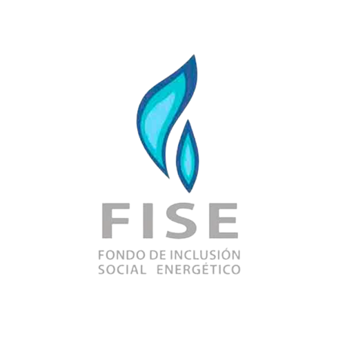
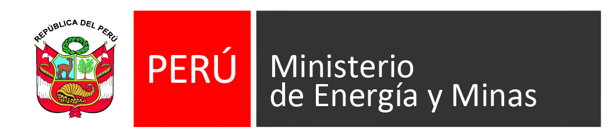
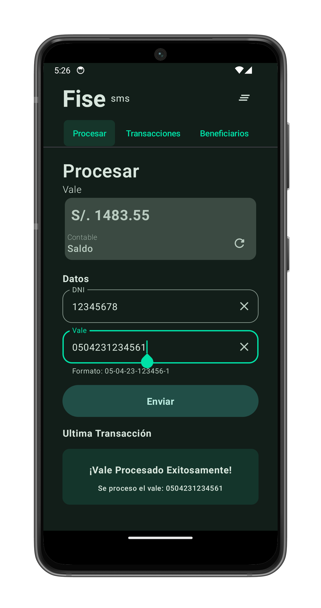

# Fise SMS 🔥


[](https://developer.android.com/studio/)
[](https://material.io/)


## Available in 

Coming soon...

[](https://github.com/georgegiosue/fisesms)
&nbsp;
[](https://github.com/georgegiosue/fisesms)
&nbsp;

## Table of Contents

1. [Overview](#overview)
2. [Installation](#installation)
3. [Contribution](#contribution)
4. [Troubleshooting](#troubleshooting)
5. [License](#license)

## Overview

### What is FISE?

<div style="display: flex; justify-content: start; align-items: center">


</div>
<br>

FISE is a social inclusion policy mechanism of the Republic of Peru, aimed at expanding the energy frontier in vulnerable segments of the population, through:

The massification of the use of natural gas (residential and vehicular) in vulnerable sectors.
The development of new supplies in the energy frontier focused on the most vulnerable populations.
Promoting access to LPG for vulnerable urban and rural sectors.
The compensation mechanism for the residential electricity tariff.

#### How does it work?

Text messages (SMS) are sent to the number `+55555` with the discount code (`VALE`) and the `DNI` number of the beneficiary.

```html
fise ah01 <DNI> <VALE>
```

To check the balance, proceed as follows:

```
saldo ah01
```

The system processes the message and returns a text message with the result of the operation.

> Read more about FISE [here](https://www.fise.gob.pe/).

### What is Fise SMS?

|||
|-|-|
||<p style="font-size: medium">Fise SMS is an android application that allows LPG (Liquefied Petroleum Gas) suppliers to <b>process discount coupons</b>, check their <b>account balance</b>, and check the latest coupons processed through transaction history. Make SMS requests quickly and easily with a user friendly interface.</p>|

## Installation

⬇️ You can download the latest version of the application in **.apk** by clicking the following link: 

[Android Application Package (APK)](https://github.com/georgegiosue/fisesms/releases/latest/download/fisesms.apk)

## Contribution

Contributions are always welcome. To contribute:

1. Fork the project.
2. Create your Feature Branch (`git checkout -b feature/AmazingFeature`).
3. Commit your changes (`git commit -m 'Add some AmazingFeature'`).
4. Push to the Branch (`git push origin feature/AmazingFeature`).
5. Open a Pull Request.

## Troubleshooting

If you encounter any problems while setting up or running the application, please check the [Issues](https://github.com/georgegiosue/fisesms/issues) section of this repository to see if your issue has already been addressed. If not, feel free to open a new issue with a description of the problem you're experiencing.

For further assistance or if you have specific questions, you can also contact me by email at [peraldonamoc@gmail.com](mailto:peraldonamoc@gmail.com).

## License

[AGPL v3](./LICENSE)